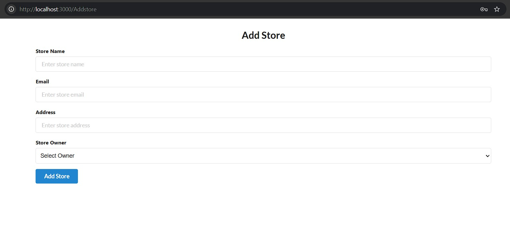
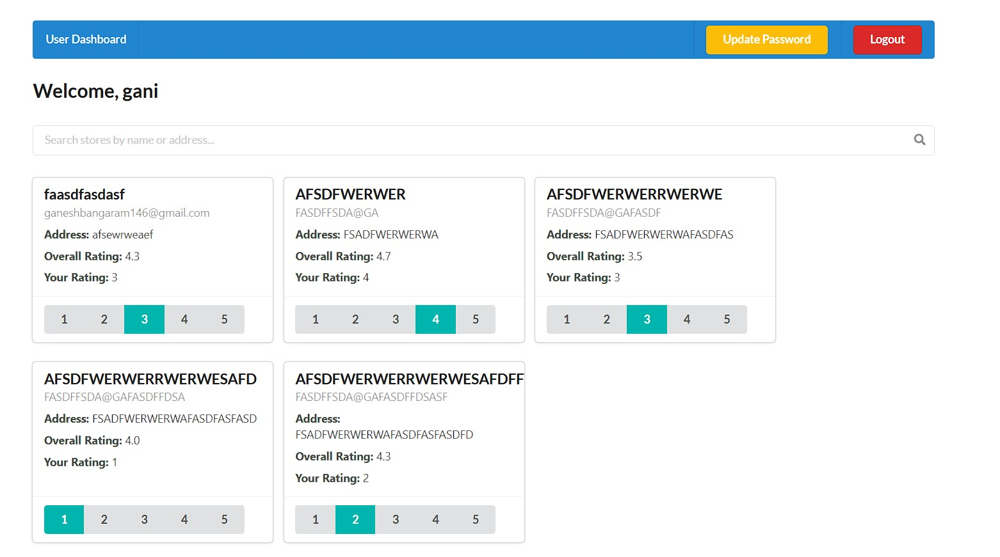

⭐ Ratings App

A full-stack Ratings Web Application where:

Admins manage stores, users, and view dashboards,total number of submittedratings,total number of users,total number of stores.

Users register, log in, and rate stores (1–5) with updates.

Store Owners track their store’s average rating and users who rated them.

Supports role-based access & insights.

 User Roles & Features

System Admin → Add stores/users/admins, view dashboards, filter/manage users & stores.

Normal User → Sign up, log in, search stores, submit/modify ratings, update password.

Store Owner → View store ratings, Average store ratings, see users who rated, update password.

Login System:
Implemented Single login system of admins and users and owners where they are directly redirected to their dashboards according to their role

 Tech Stack

Frontend: React.js

Backend: Node.js, Express.js

Database: MySQL 

Website Interface:

Login Page for all admins,owners,users:

Register Page for admins,owners,users:

Admin dashboard:

list of stores in Admin Dashboard:

Store registration through Admin:

User Dashboard:

Store Owner Dashboard:

Update Password for users and store owners:

